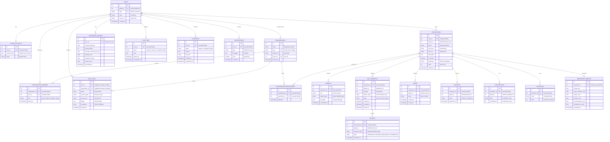

# RepoHub Entity-Relationship (ER) Documentation

This document describes the complete relational database schema for RepoHub.

---

## Complete Entity-Relationship Diagram

```mermaid
erDiagram
    USERS ||--o| GITHUB_ACCOUNTS : "has"
    USERS ||--o{ REPOSITORIES : "owns"
    USERS ||--o{ ORGANIZATION_MEMBERS : "belongs_to"
    USERS ||--o{ ORGANIZATIONS : "creates (owner)"
    USERS ||--o{ DEVELOPER_METRICS : "has"
    USERS ||--o{ SYNC_JOBS : "triggers"
    USERS ||--o{ AI_REPORTS : "requests"
    USERS ||--o{ NOTIFICATIONS : "receives"
    USERS ||--o{ AUDIT_LOGS : "performs"

    ORGANIZATIONS ||--|{ ORGANIZATION_MEMBERS : "contains"
    ORGANIZATIONS ||--o{ ORGANIZATION_REPOSITORIES : "tracks"
    ORGANIZATIONS ||--o{ AUDIT_LOGS : "scopes"

    REPOSITORIES ||--o{ ORGANIZATION_REPOSITORIES : "belongs_to"
    REPOSITORIES ||--o{ COMMITS : "contains"
    REPOSITORIES ||--o{ PULL_REQUESTS : "contains"
    REPOSITORIES ||--o{ ISSUES : "contains"
    REPOSITORIES ||--o{ RELEASES : "contains"
    REPOSITORIES ||--o{ CONTRIBUTORS : "has"
    REPOSITORIES ||--o{ LANGUAGES : "uses"
    REPOSITORIES ||--o| REPOSITORY_METRICS : "calculates"

    PULL_REQUESTS ||--o{ REVIEWS : "receives"

    USERS {
        int id PK
        int github_id UK "Unique GitHub ID"
        string login UK "GitHub username"
        string name "Full Name"
        string avatar_url "Avatar URL"
        timestamp created_at
    }

    GITHUB_ACCOUNTS {
        int id PK
        int user_id FK "Cascade Delete"
        text access_token "OAuth Access Token"
        string scope "OAuth Scope"
    }

    ORGANIZATIONS {
        int id PK
        string name "Organization Name"
        string slug UK "Unique URL Identifier"
        string avatar_url "Logo URL"
        int owner_id FK "User ID"
        timestamp created_at
    }

    ORGANIZATION_MEMBERS {
        int id PK
        int organization_id FK "Cascade Delete"
        int user_id FK "Cascade Delete"
        string role "owner | admin | member | viewer"
        timestamp joined_at
    }

    ORGANIZATION_REPOSITORIES {
        int id PK
        int organization_id FK "Cascade Delete"
        int repository_id FK "Cascade Delete"
        timestamp added_at
    }

    REPOSITORIES {
        int id PK
        int user_id FK "Cascade Delete"
        int github_id "GitHub Repository ID"
        string name "Repository Name"
        string full_name "owner/name"
        string html_url "GitHub URL"
        text description
        boolean is_private
        string language "Primary Language"
        int stars "Star Count"
        timestamp updated_at
    }

    COMMITS {
        int id PK
        int repository_id FK "Cascade Delete"
        string sha "Commit SHA-1"
        string author_login "Author GitHub Login"
        text message "Commit Message"
        timestamp committed_at
    }

    PULL_REQUESTS {
        int id PK
        int repository_id FK "Cascade Delete"
        int github_id "GitHub PR ID"
        int number "PR Number"
        string author_login "Author GitHub Login"
        string state "open | closed | merged"
        timestamp created_at
        timestamp merged_at
        timestamp closed_at
    }

    REVIEWS {
        int id PK
        int pull_request_id FK "Cascade Delete"
        int github_id "GitHub Review ID"
        string reviewer_login "Reviewer GitHub Login"
        string state "APPROVED | CHANGES_REQUESTED | COMMENTED"
        timestamp submitted_at
    }

    ISSUES {
        int id PK
        int repository_id FK "Cascade Delete"
        int github_id "GitHub Issue ID"
        string state "open | closed"
        timestamp created_at
        timestamp closed_at
    }

    RELEASES {
        int id PK
        int repository_id FK "Cascade Delete"
        int github_id "GitHub Release ID"
        string name "Release / Tag Name"
        timestamp published_at
    }

    CONTRIBUTORS {
        int id PK
        int repository_id FK "Cascade Delete"
        int github_id "GitHub Contributor ID"
        string login "Contributor Login"
        int contributions "Contribution Count"
    }

    LANGUAGES {
        int id PK
        int repository_id FK "Cascade Delete"
        string name "Language Name"
        int bytes "Code Size in Bytes"
    }

    DEVELOPER_METRICS {
        int id PK
        int user_id FK "Unique per user"
        float commit_frequency
        int coding_streak
        float average_commits_per_day
        float coding_hours
        float weekend_activity
        float review_score
        timestamp calculated_at
    }

    REPOSITORY_METRICS {
        int id PK
        int repository_id FK "Unique per repository"
        float merge_rate
        float issue_resolution_rate
        float health_score
        float activity_score
        float documentation_score
        float maintenance_score
        timestamp calculated_at
    }

    AUDIT_LOGS {
        int id PK
        int user_id FK "Nullable (Set Null on delete)"
        int organization_id FK "Nullable (Cascade on delete)"
        string action "Event Action"
        string resource_type "Resource Type"
        string resource_id "Resource ID"
        text details "JSON Details"
        string ip_address "Client IP Address"
        timestamp created_at
    }

    SYNC_JOBS {
        int id PK
        int user_id FK "Cascade Delete"
        string status "queued | running | completed | failed"
        text error
        timestamp started_at
        timestamp completed_at
    }

    AI_REPORTS {
        int id PK
        int user_id FK "Cascade Delete"
        string status "queued | completed | failed"
        text content
        string file_path
        timestamp created_at
        timestamp completed_at
    }

    NOTIFICATIONS {
        int id PK
        int user_id FK "Cascade Delete"
        string type "Notification Type"
        text message "Content"
        boolean read "Read Flag"
        timestamp created_at
    }
```
